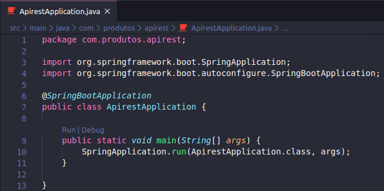
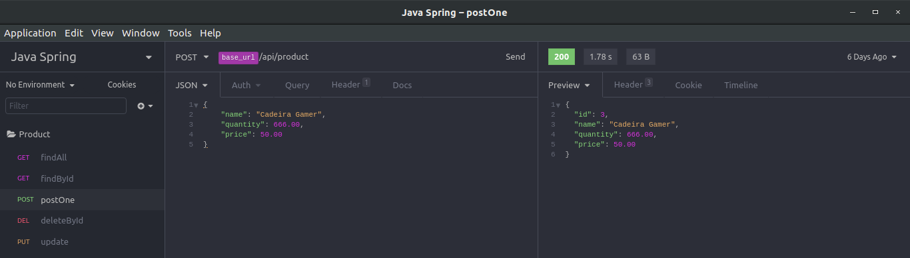
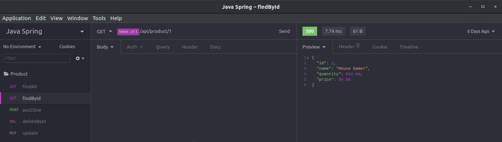
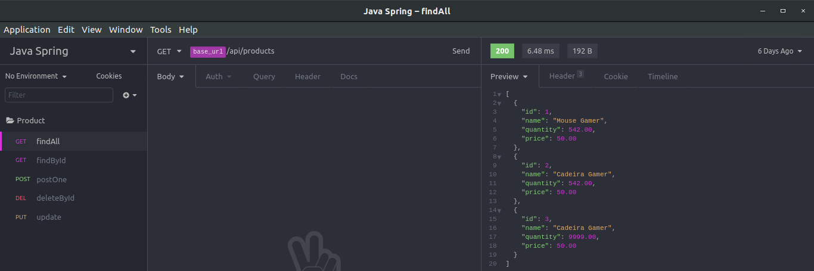
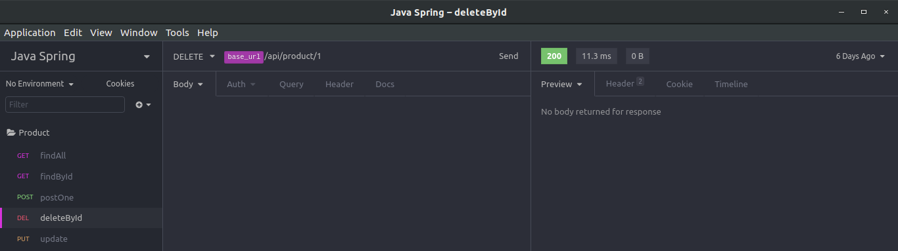
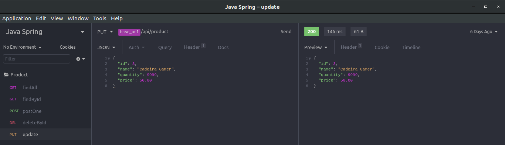

# Minha primeira API Rest utilizando Java Spring

### Introdução

<p style='text-align: justify;'>
Estou em uma jornada rumo a senioridade no que diz respeito a programação backend, talvez eu ainda esteja um pouco longe de atingir este objetivo, mas eu preciso começar por algum lugar.

JavaScript é a minha linguagem preferida, mas pelo que tenho observado não há como ser um bom programador sem dominar ao menos uma linguagem fortemente tipada e orientada a objetos como Java ou C#.

Se isso pareceu muito forte para você, calma! Eu não estou falando que não existem bons desenvolvedores que codificam com JavaScript ou que Java e C# são melhores do que Node.js.

O que eu quero dizer é que no caminho de dominar linguagens como Java, nós programadores adquirimos muita experiência e aprendemos muitas coisas importantes.

Pensando nisso, concluo que é importante dominar Node.js, mas também é de extrema importância dominar uma linguagem fortemente tipada e orientada a objetos como Java ou C#.

A verdade é que nenhuma linguagem é especial, unica, ou a resposta absoluta para todos os problemas.

<blockquote>
"Para quem só sabe usar martelo, todo problema é um prego."
</blockquote>
- Abraham Maslow
<br />
<br />
<blockquote>
"Linguagens de programação são ferramentas e devem servir aos seus mestres, elas não merecem lealdade ou torcida organizada."
</blockquote>
- Fabio Akita
</p>

### Iniciando

O primeiro passo foi acessar o site [Spring Initializr](https://start.spring.io/) e gerar um projeto Java Spring de acordo com as seguintes opções:

#### Project

- [x] Maven Project
- [ ] Gradle Project

#### Language

- [x] Java
- [ ] Groovy
- [ ] Kotlin

#### Spring Boot

- [ ] 2.3.0 M3
- [ ] 2.3.0 (SNAPSHOT)
- [ ] 2.2.7 (SNAPSHOT)
- [x] 2.2.6
- [ ] 2.1.14 (SNAPSHOT)
- [ ] 2.1.13

#### Project Metadata

- Group: com.produtos
- Artifact: apirest
- Name: apirest
- Package Name: com.produtos.apirest
- Packaging: Jar
- Java Version: 8

#### Dependencies

- [x] DevTools
- [x] Web
- [x] JPA
- [x] MySQL

Depois disso, basta gerar o projeto!

Abra o projeto com a sua IDE ou editor preferido, pelo que observei, as mais comuns são:

- Netbeans
- Eclipse
- Intellij

Mas vou utilizar o **Vs Code** mesmo.

#### Instalando o Swagger

Para instalar o Swagger no projeto basta abrir o **arquivo pom.xml** (que funciona de forma semelhante ao **Package.json** do Node.js) e adicionar a seguinte dependência:

```xml
<dependency>
    <groupId>io.springfox</groupId>
    <artifactId>springfox-swagger2</artifactId>
    <version>2.7.0</version>
</dependency>

<dependency>
    <groupId>io.springfox</groupId>
    <artifactId>springfox-swagger-ui</artifactId>
    <version>2.7.0</version>
</dependency>
```

Pronto, quando você rodar o projeto, o Maven irá instalar todas as dependências especificadas no pom.xml.

#### Rodando a aplicação

Para rodar a aplicação basta procurar o botão "RUN" ou "Executar" na sua IDE, na maioria das IDE's o atalho é F5, mas como estou utilizando o Vs Code basta clicar em "Run" como mostrado na imagem abaixo:


(Lembrando que você pode muito bem fazer isso via linha de comando também).

#### Configurando o banco de dados e afins

Na pasta resources existe um arquivo **application.properties**, ele funciona de forma semelhante ao arquivo **.env** do Node.js, observe:

```properties
spring.jpa.properties.hibernate.jdbc.lob.non_contextual_creation=true

#banco de dados local produtosapirest

spring.jpa.hibernate.ddl-auto=create
spring.datasource.url=jdbc:mysql://localhost:3306/produtosapirest
spring.datasource.username=meuUsuarioAqui
spring.datasource.password=minhaSenhaAqui
```

(Estamos utilizando o ORM Hibernate)

#### A parte que todos estão esperando

O código em si é bem óbvio e autoexplicativo.

```java
@RestController
@RequestMapping(value = "/api")
@Api(value = "API REST Products")
@CrossOrigin(origins = "*")
public class ProductResource {

    @Autowired
    ProductRepository productRepository;

    @GetMapping("/products")
    @ApiOperation(value = "Returns a list of products")
    public List<Product> listProduct() {
        return productRepository.findAll();
    }

    @GetMapping("/product/{id}")
    @ApiOperation(value = "Returns an product")
    public Optional<Product> Product(@PathVariable(value = "id") long id) {
        return productRepository.findById(id);
    }

    @PostMapping("/product")
    @ApiOperation(value = "Creates a new product")
    public Product saveProduct(@RequestBody Product product) {
        return productRepository.save(product);
    }

    @DeleteMapping("/product/{id}")
    @ApiOperation(value = "Deletes a product")
    public void deleteProductById(@PathVariable(value = "id") long id) {
        Product product = productRepository.getOne(id);
        productRepository.delete(product);
    }

    @PutMapping("/product")
    @ApiOperation(value = "Updates a product")
    public Product updateProduct(@RequestBody Product product) {
        return productRepository.save(product);
    }

}

```

Para testar a API utilizei o **Insominia**, mas fique a vontade para usar qualquer outro como **Postman** por exemplo.

A utilização também não tem segredo e dispensa comentários:

- Post
  

- FindById
  

- FindAll
  

- DeleteById
  

- Update
  

#### Considerações finais

Estou gostando muito de aprender sobre Java Spring e pretendo seguir em frente atualizando este repositório com novos conhecimentos.

Gostaria de ressaltar aqui, que eu não fiz isso do zero, pelo contrário, obtive muito conhecimento através da [Michelli Brito](https://github.com/MichelliBrito) e eu gostaria de deixar aqui meus sinceros agradecimentos por produzir um conteúdo de tão alta qualidade e disponibiliza-lo gratuítamente para que um dia chegasse até mim.

**Iniciei com a ajuda a Michelli, mas a partir de agora farei o possível para incrementar o projeto e somar com a comunidade!**

I hope that you enjoyed! :see_no_evil:
